# OiramRPG

RPG em Unity 6 com **exploração e batalhas por turnos estilo Super Mario RPG** (timed hits!),
**sistema de jobs inspirado em Final Fantasy Tactics** e **muito loot estilo Diablo** (raridades + afixos aleatórios).

Conteúdo atual: o **Vale** (introdução com o Golem), um **mapa-múndi**, a **Vila Ventura** (lojas, pousada com save
e um baú escondido com uma Relíquia) e **três dungeons com mapas aleatórios** que escalam com o nível da party
em quatro dificuldades. Três heróis, cinco jobs, onze tipos de inimigo, quatro chefes e loot procedural.
Visual **toon com contorno** e música/efeitos sonoros **gerados por código** — não há arquivos de modelo, textura de
personagem nem áudio: tudo é montado pelo jogo (shaders próprios, malhas geradas, chiptune).

| Exploração | Batalha | Vitória e loot |
|---|---|---|
| 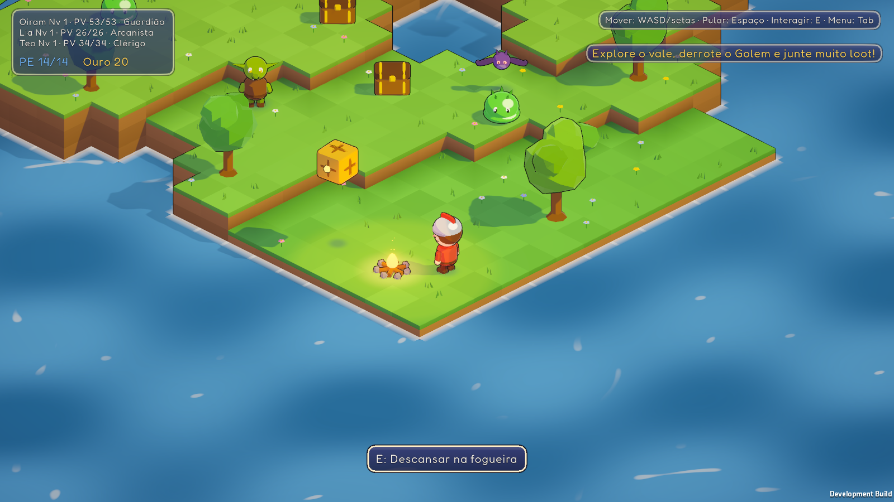 | 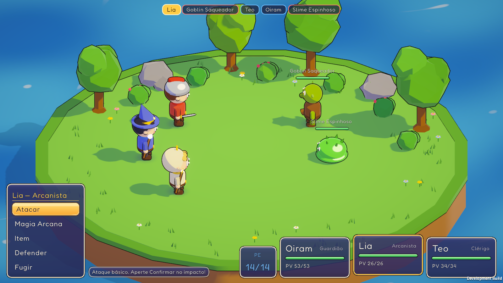 | 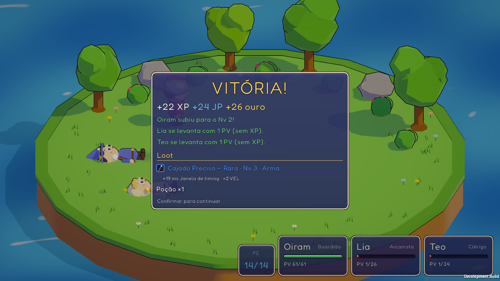 |
| **Inventário** | **Título** | **Mapa-múndi** |
| 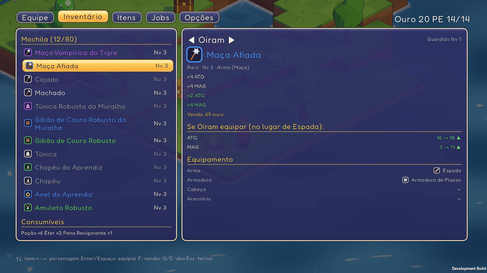 | 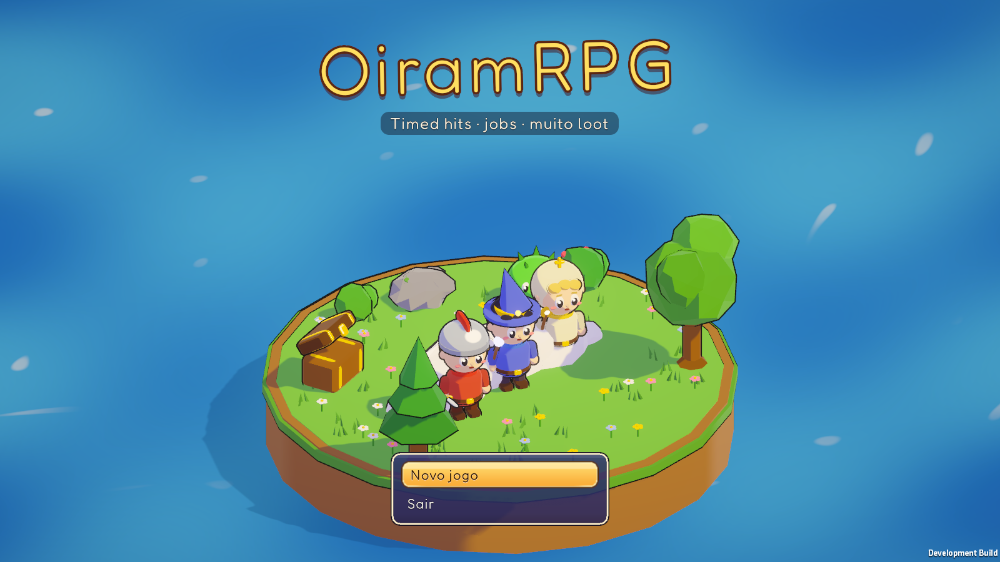 | 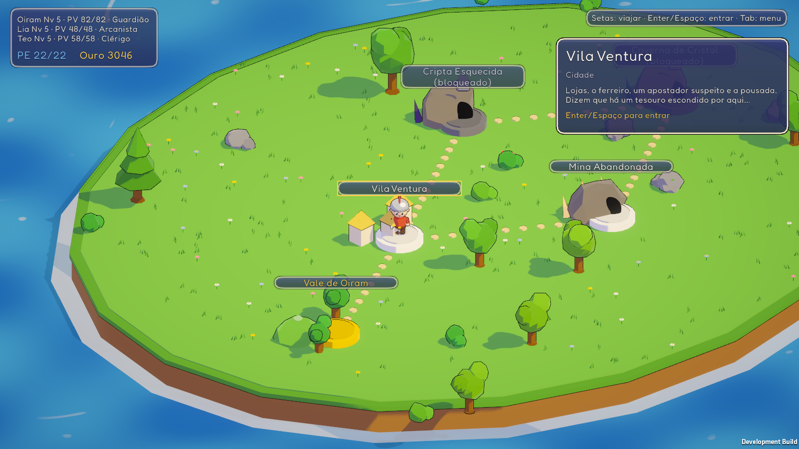 |
| **Vila e baú escondido** | **Ferreiro** | **Dungeon (aleatória)** |
| 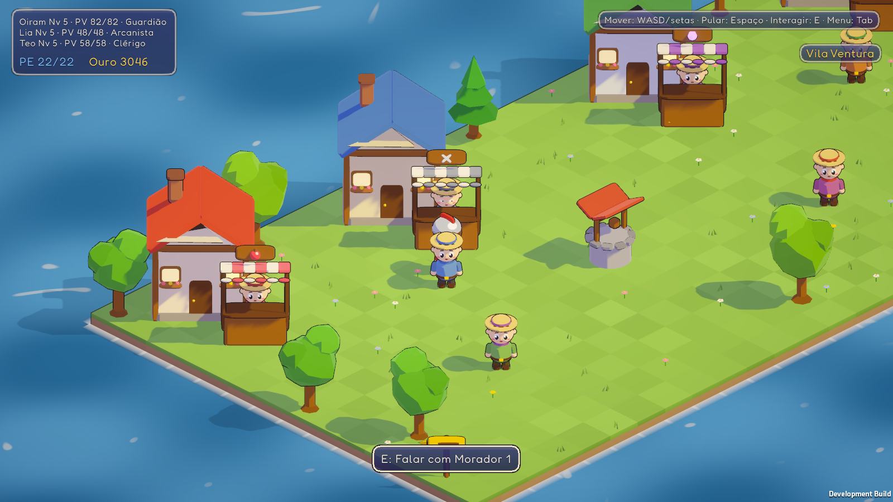 | 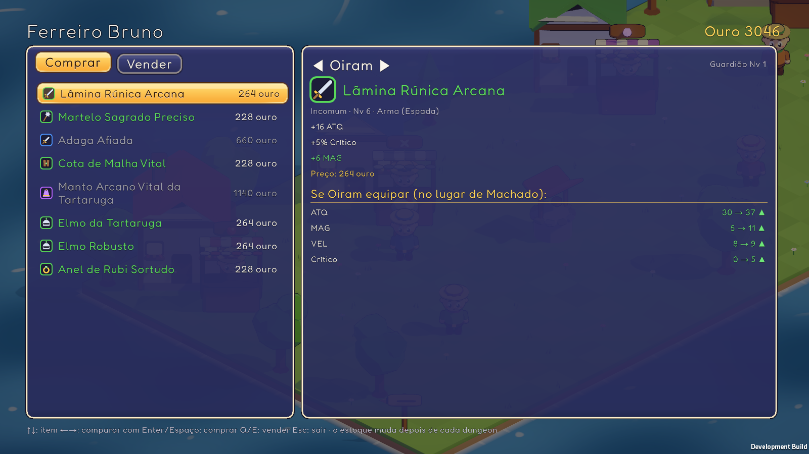 | 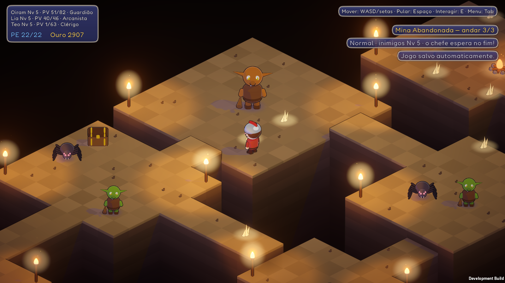 |
| **Anel de timing** | **Itens fora da batalha** | **Opções** |
| 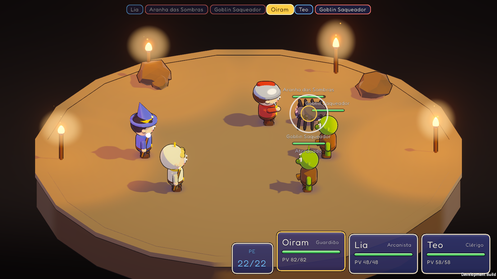 | 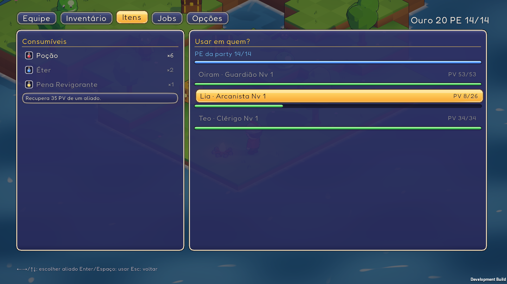 | 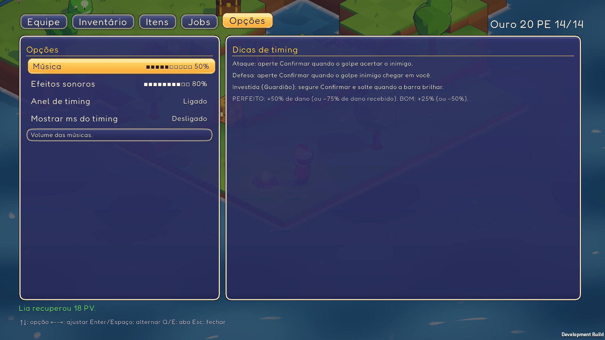 |

## Como abrir e jogar

1. Unity Hub ▸ **Add project from disk** ▸ `C:\Projetos\Games\OiramRPG` (Unity **6000.6.4f1**).
2. Abra `Assets/_Project/Scenes/Title.unity` e aperte **Play** (ou `Field_Vale` para pular o título).
   - Atalhos para testar: `Battle_Arena` (luta em loop), `Dungeon` (gera uma descida Normal na Mina na hora),
     `Town_Vila`, `WorldMap`.
3. Ou rode o build: `Builds/Windows/OiramRPG.exe` (gerado pelo menu **OiramRPG ▸ Build Windows**).

## Controles

| Ação | Teclado | Gamepad |
|---|---|---|
| Mover / navegar menus | WASD ou setas | Analógico / D-pad |
| Pular | Espaço | A (Sul) |
| Interagir (baú, fogueira, lojas, moradores, placas, escadas) | E ou Enter | X (Oeste) |
| Confirmar / **timed hit** | Espaço, Enter ou Z | A (Sul) |
| Cancelar / voltar | Esc, Backspace ou X | B (Leste) |
| Menu de pausa | Tab ou I | Start |
| Trocar aba do menu | Q / E | LB / RB |
| Vender item (inventário) | F | Y (Norte) |

**Timed hits:** aperte Confirmar no instante do impacto do seu ataque (BOM ×1.25, PERFEITO ×1.5) e
no impacto do ataque inimigo para defender (dano ×0.5 / ×0.25). Só o primeiro aperto conta.
Um **anel** encolhe sobre o alvo e encosta no círculo exatamente no impacto (dourado no ataque, azul na defesa) —
dá para desligar em **Opções**. A *Investida* do Guardião é de segurar e soltar quando a barra brilhar; o *Golpe Duplo*
pede um aperto por golpe.

**Atalhos de teste** (editor e development builds): F1 = 10 itens aleatórios · F2 = +100 ouro ·
F3 = cura total · F4 = +100 JP · F5 = +1 nível · F6 = mostrar em milissegundos o quão cedo/tarde foi cada timed hit.

## Sistemas

- **Exploração:** câmera isométrica, pulo (desníveis de 0,5 m exigem pulo), inimigos visíveis.
  Cair em cima de um inimigo = **ataque preventivo** (inimigos começam atordoados). Baús, caixas
  flutuantes (bata por baixo), fogueira (recupera tudo) e um baú que é Mímico.
- **Batalha:** ordem por Velocidade, pool de **PE compartilhado** pela party, status (Queimadura,
  Atordoado, Provocar, ATQ+/DEF+), fuga, e loot que "pula" do inimigo com um pilar de luz na cor da raridade.
- **Jobs (FFT):** cada herói ganha JP no job atual, aprende habilidades com JP, escolhe um
  **skillset secundário** de outro job e uma **passiva de suporte**. Jobs: Aprendiz, Guardião,
  Arcanista, Clérigo, Ladino (alguns exigem níveis de Aprendiz). O Ladino tem *Roubar*, que rola o loot do inimigo.
- **Loot:** Comum → Lendário (0–4 afixos), afixos com tiers liberados pelo nível do item, Achado Mágico,
  nomes com concordância ("Espada Afiada do Tigre", "Elmo Robusto da Coruja"). Afixos especiais conversam
  com os timed hits: *Preciso* (janela maior), *Flamejante* (Perfeito queima), *do Reflexo* (defesa perfeita reflete dano).

## Visual

- **Shaders próprios** (`Assets/_Project/Shaders`): `Oiram/Toon` (luz em duas faixas com sombra azulada, brilho de borda,
  destaque especular opcional, tochas em faixas, emissão para o bloom e **contorno** por casco invertido com normais
  suavizadas), `Oiram/Water` (ondinhas e brilhos animados), `Oiram/Sky` (céu em degradê) e `Oiram/Glow` (partículas, halos, sombras suaves).
- **Pós-processamento** (URP): bloom leve, cores mais vivas, tonemapping neutro, vinheta; MSAA 4× no perfil PC.
- **Personagens chibi** com rosto (olhos com brilho, bochechas), **chapéu e arma do job** (elmo do Guardião, chapéu de mago
  da Arcanista, capuz do Clérigo, bandana do Ladino, boné do Aprendiz) e um rig procedural: andar, piscar, respirar, pular
  e erguer a arma nos golpes. O herói do mapa troca de visual quando o líder muda de job.
- **Inimigos** redesenhados e animados (asas batendo, pernas de aranha, mandíbula do esqueleto, olhos e núcleos brilhando).
- **Terreno** numa malha só: borda de grama, laterais em camadas que escurecem para baixo, sombra nos cantos junto a
  paredes, tufos e flores; água com espuma na margem; cristais brilhando nas dungeons. Casas com telhado, chaminé e janelas
  acesas; barracas com toldo listrado; tochas com chama, halo, brasas e luz tremulando.
- **Partículas** por código: faíscas nos golpes, estrelas no PERFEITO/crítico, fumaça ao derrotar inimigos, brilhos
  subindo na cura e no loot, poeira nos pulos, rastro nas magias.
- **Interface**: fonte [Fredoka](https://github.com/google/fonts/tree/main/ofl/fredoka) (licença OFL, em
  `Resources/UI/Fonts`), molduras 9-slice geradas por código (`OiramRPG ▸ Interface ▸ Gerar molduras da UI`), barras com
  brilho, **ícones de item desenhados com vetores** por categoria e raridade, logo animado no título.

## Game feel

- **Áudio procedural** (`Scripts/Audio`): um sintetizador chiptune gera ~30 efeitos (golpes, defesas, menus, baús,
  moedas, subir de nível...), um *jingle* de loot por raridade (Raro+ toca quando o item cai) e 7 músicas em loop
  (título, Vale, mapa-múndi, valsa da vila, dungeon com eco, batalha e chefe). As músicas são compostas a partir de
  progressões de acordes escritas à mão e melodias geradas com semente fixa — sempre as mesmas.
  Para ouvir fora do jogo: **OiramRPG ▸ Áudio ▸ Exportar WAVs** (grava em `Builds/Audio`, com pico/RMS de cada som).
- **Impacto:** no PERFEITO o jogo congela por um instante (*hit-stop*), solta estrelas e treme a câmera; críticos e golpes
  de chefe tremem mais; os números de dano "estouram" e assentam. Poeira e som ao cair de um pulo.
- **Menu de pausa** com 5 abas: Equipe · Inventário · **Itens** (Poção, Éter e Pena fora da batalha — o item não é gasto
  se não fizer efeito) · Jobs · **Opções** (volume da música e dos efeitos, anel de timing, mostrar ms do timing).
  As opções ficam salvas entre sessões.

## Mundo, cidade e dungeons

- **Mapa-múndi:** setas viajam entre os pontos ligados por caminhos; Enter entra. O Vale é o começo; a saída
  do Vale (placa perto do Golem) só abre depois de vencê-lo. Cada dungeon concluída libera a próxima.
- **Vila Ventura:** *Mercearia* (consumíveis, inclusive Poção Grande), *Ferreiro* (8 equipamentos aleatórios no seu
  nível; o estoque renova a cada dungeon concluída ou abandonada; também compra seus itens), *Apostador* (item
  misterioso de um tipo escolhido — nunca Comum, às vezes Lendário), *Pousada* (descansar e **salvar**).
  Os moradores dão dicas... inclusive sobre um **baú invisível flutuando** — pule exatamente embaixo dele.
- **Relíquia** (nova raridade, cor ciano): só nos baús escondidos, um por cidade — 5 afixos no valor máximo,
  3 níveis acima da party.
- **Dungeons:** cada entrada gera andares novos (salas + corredores com desníveis). Escolha a dificuldade ao entrar:

  | | Inimigos | Andares | Recompensa (XP/JP/ouro) | Achado mágico | Tesouro do chefe |
  |---|---|---|---|---|---|
  | Fácil | nível da party −15% | 2 | ×0.75 | +0% | Incomum+ |
  | Normal | nível da party | 3 | ×1 | +20% | Raro+ |
  | Difícil | +25% (mín. +1) | 3 | ×1.35 | +50% | Raro+ |
  | Pesadelo | +50% (mín. +2), grupos maiores | 4 | ×1.8 | +100% | Épico+ |

  O último andar tem uma fogueira e o chefe; vencer libera o tesouro e o portal de saída. Se a party cair,
  acorda no mapa-múndi (fica com o loot coletado). O portal do primeiro andar abandona a descida.
- **Save:** na pousada e **automático** no mapa-múndi e no começo de cada andar de dungeon. **Continuar** (título)
  volta para onde parou — inclusive para o mesmo andar, com o mesmo mapa.

## Onde fica cada coisa

```
Assets/_Project/
  Scripts/      runtime (asmdef OiramRPG) — Core, Stats, Characters, Loot, Inventory, Battle, Field, UI, World, Debug
  Scripts/World/    mapa-múndi, gerador de dungeons, construtor de mapas em blocos, lojas, fluxo de cenas
  Scripts/Balance/  simulador de batalhas e rotas (playtest automatizado) e relatório de balanceamento
  Editor/       ContentSeeder, LevelBuilder, VerticalSliceBuilder, BuildScript, BalanceRunner, PlaytestAnalyzer
  Data/         conteúdo em ScriptableObjects (itens, afixos, jobs, inimigos...), gerado de DefaultContent.cs
  Resources/    GameDatabase.asset, estilos da UI (UI Toolkit), material base
  Levels/       Field_Vale.txt, Town_Vila.txt — layouts em texto (alturas + objetos)
  Scenes/       Title, Field_Vale, Battle_Arena, WorldMap, Town_Vila, Dungeon (geradas pelo construtor)
  Tests/        EditMode (regras) e PlayMode (ponta a ponta)
```

As regras (stats, loot, dano, turnos, jobs, inventário) são C# puro com aleatoriedade injetável,
cobertas por testes. Os números do jogo vivem em **`Scripts/Core/DefaultContent.cs`** (fonte da verdade
durante o balanceamento) e são copiados para os assets de `Data/` pela sincronização (abaixo).

## Balanceamento e playtest

- **Simulador:** `OiramRPG ▸ Balanceamento ▸ Simular rota e gerar relatório` joga a rota inteira do Vale centenas
  de vezes com três perfis de jogador (iniciante, médio, experiente), usando as mesmas regras do jogo, e escreve
  [Docs/balanceamento.md](Docs/balanceamento.md) com as metas (✅/❌), vitórias, rodadas, dano, nível, loot e o peso dos timed hits.
  As metas ficam em `BalanceReport.DefaultTargets()` e o teste `BalanceGuardTests` falha se alguma for quebrada.
- **Playtest humano:** veja [Docs/playtest.md](Docs/playtest.md). O jogo grava um log de cada sessão (editor e development builds)
  e `OiramRPG ▸ Balanceamento ▸ Analisar logs de playtest` gera `Docs/playtest-analise.md` com a sua precisão real nos timed hits,
  uma sugestão de calibração de latência e uma previsão do simulador com o seu perfil.

Fluxo para mudar números: edite `DefaultContent.cs` (ou `BalanceConfig.cs`) → rode o simulador em batch (ele sincroniza
os assets antes) → confira o relatório → rode os testes.

```bash
"/c/Program Files/Unity/Hub/Editor/6000.6.4f1/Editor/Unity.exe" -batchmode -quit -projectPath . -executeMethod Oiram.EditorTools.BalanceRunner.RunBatch -logFile balance.log
```

## Reconstruir o mapa e o conteúdo

- **OiramRPG ▸ Construir Fatia Vertical** — recria as cenas a partir de `Levels/Field_Vale.txt`
  (cria o conteúdo em `Data/` só se ainda não existir). Edite o `.txt` e rode de novo para mudar o mapa.
- **OiramRPG ▸ Conteúdo ▸ Sincronizar com o código** — copia os valores de `DefaultContent.cs` para os assets de `Data/`
  mantendo os GUIDs (as cenas continuam funcionando). Edições feitas no Inspector são sobrescritas.
- **OiramRPG ▸ Conteúdo ▸ Recriar conteúdo padrão** — apaga `Data/` e recria tudo do código (depois reconstrua as cenas).

Pela linha de comando (com o editor fechado):

```bash
"/c/Program Files/Unity/Hub/Editor/6000.6.4f1/Editor/Unity.exe" -batchmode -quit -projectPath . -executeMethod Oiram.EditorTools.VerticalSliceBuilder.BuildAll -logFile build.log
```

## Testes

No editor: **Window ▸ General ▸ Test Runner** (EditMode e PlayMode). Pela linha de comando:

```bash
"/c/Program Files/Unity/Hub/Editor/6000.6.4f1/Editor/Unity.exe" -batchmode -projectPath . -runTests -testPlatform EditMode -testResults editmode.xml
```

```bash
"/c/Program Files/Unity/Hub/Editor/6000.6.4f1/Editor/Unity.exe" -batchmode -projectPath . -runTests -testPlatform PlayMode -testResults playmode.xml
```

Os testes PlayMode precisam das cenas no Build Settings (rode o construtor uma vez).

## Próximos passos sugeridos

Playtest humano (calibrar os timed hits com os logs), mais cidades e dungeons, chefes com mecânicas,
arte low-poly real + animações e localização.
